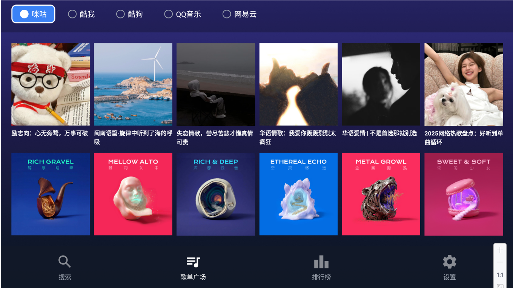
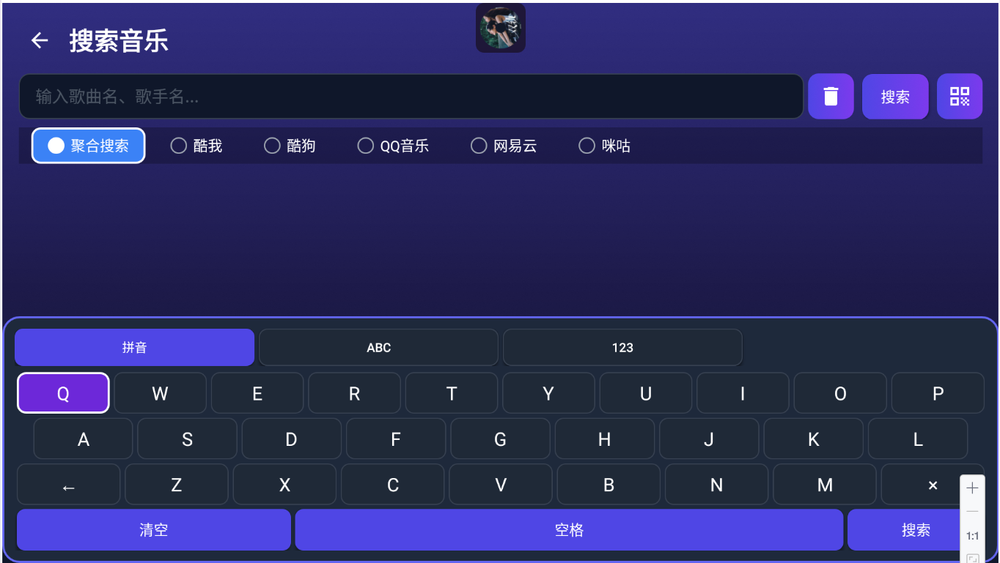
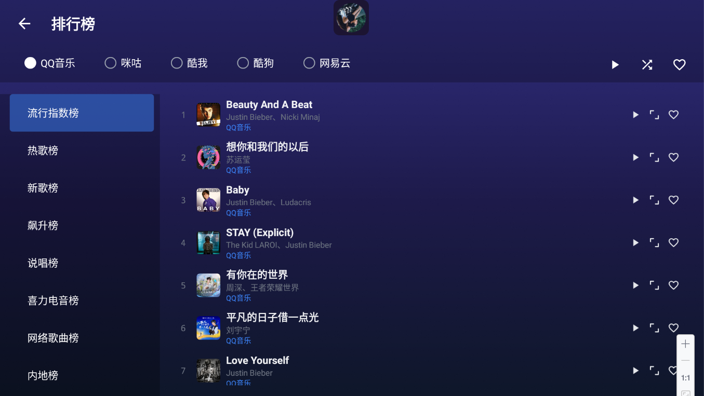
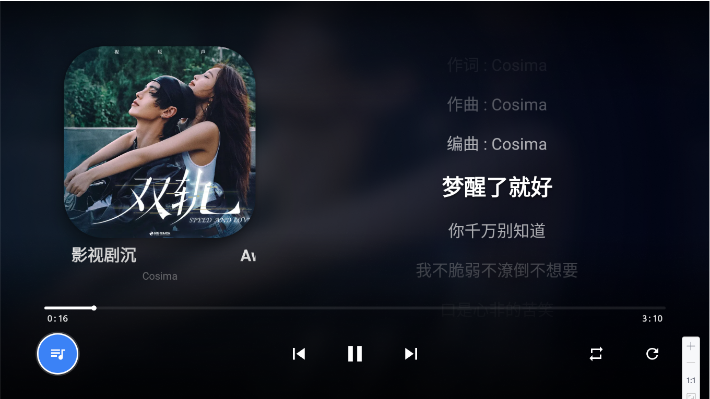

# TV端音乐播放器

前端基于 [RouRouMusic (肉肉音乐)](https://github.com/GanHuaLin/rouroumusic-tv) 开发。

后台接口基于 [LX Server](https://github.com/XCQ0607/lxserver)

---

## 功能特点

- **电视原生界面**：针对大屏幕高度优化的 UI，大字体、清晰的焦点提示。
- **全遥控器支持**：完全适配 D-Pad 操作，流畅的导航切换体验。
- **沉浸式播放器**：
  - 基于专辑封面的动态毛玻璃背景
  - 实时同步歌词显示
  - 播放列表抽屉，支持快速切歌
- **智能音乐刮削**：播放时若服务端缺失封面或歌词，自动调用第三方接口补全
- **便捷连接**：支持手机扫码/输入服务器地址，配合洛雪音乐后端使用
- **原生性能**：基于 Android 原生 Java 开发，启动快、运行稳、占用低
- **已测试设备**：小米电视澎湃OS2/3

---

## 界面预览

| 快速登录 | 歌单广场 | 搜索界面 | 排行榜界面 | 大屏播放器界面 |
| :---: | :---: | :---: | :---: | :---: |
|  |  |  |  |  |

---

## 安装与使用

### 下载运行
1. 前往本仓库的 [Releases](https://github.com/boluofan/music-tv/releases) 下载 APK
2. 安装到 Android TV 或电视盒子

### 初次配置
1. **手机快速配置（推荐）**：电视屏幕显示二维码/IP地址，手机浏览器访问输入服务器信息推送
2. **手动输入**：遥控器直接输入服务器地址

---

## 编译指南

```bash
git clone https://github.com/boluofan/music-tv.git
cd music-tv
./gradlew assembleDebug
```

**项目要求：**
- Android SDK 21+ (安卓5.0以上)
- Android Studio Chipmunk+

---

## 技术栈

| 类别 | 技术 |
|------|------|
| 播放器 | Media3 ExoPlayer 1.2.0 |
| 网络 | Retrofit 2.9.0 + OkHttp 4.9.0 |
| 图片 | Glide 4.12.0 |
| 内嵌服务器 | NanoHttpd 2.3.1 |
| 二维码 | ZXing 3.5.3 |

---

## 感谢

- [RouRouMusic](https://github.com/GanHuaLin/rouroumusic-tv)：基础代码
- [LX Server](https://github.com/XCQ0607/lxserver)：后端服务支持

---

## 开源协议

[MIT License](LICENSE)