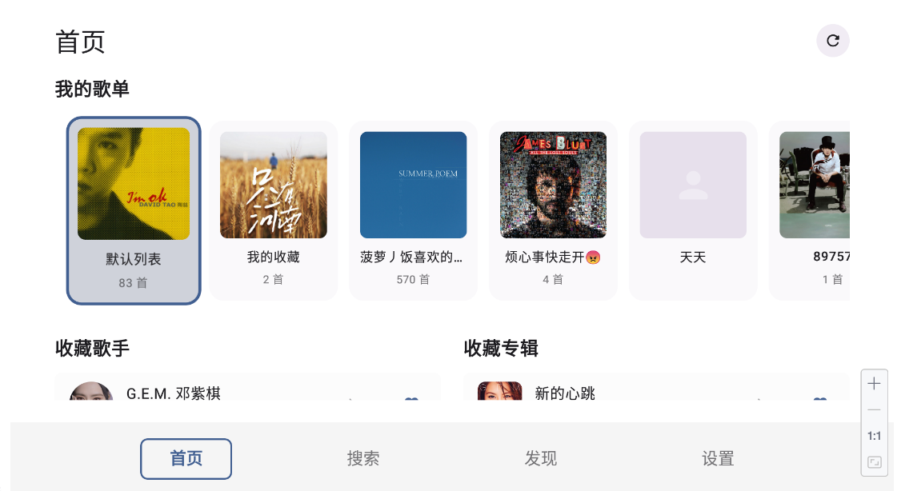
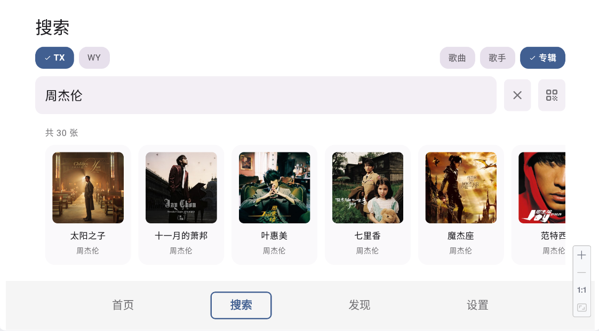
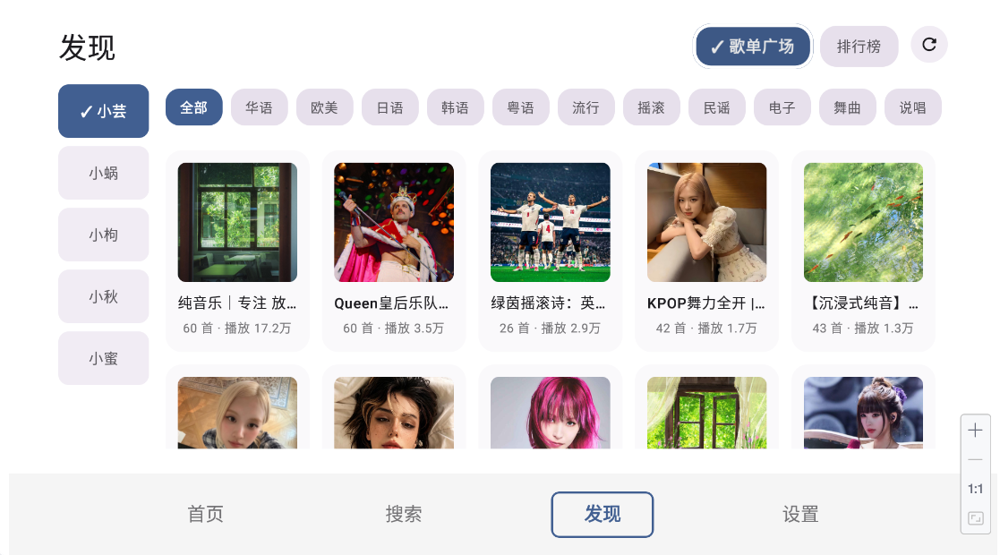
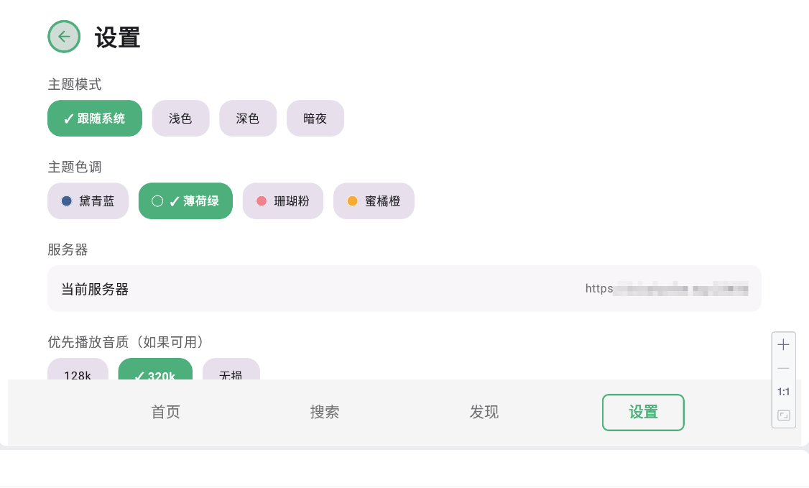
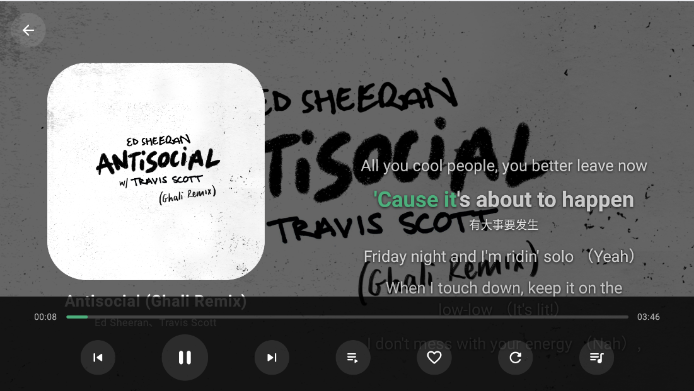

# TV端音乐播放器

前端基于 [songloft-tv](https://github.com/boluofan/songloft-tv) 开发。

后台接口基于 [LX Server](https://github.com/XCQ0607/lxserver)

---

## 功能特点

- **电视原生界面**：针对大屏幕高度优化的 UI，大字体、清晰的焦点提示。
- **全遥控器支持**：完全适配 D-Pad 操作，流畅的导航切换体验。
- **沉浸式播放器**：
  - 基于专辑封面的动态毛玻璃背景
  - 实时同步歌词显示
  - 播放列表抽屉，支持快速切歌
- **智能音乐刮削**：播放时若服务端缺失封面或歌词，自动调用第三方接口补全
- **便捷连接**：支持手机扫码/输入服务器地址，配合洛雪音乐后端使用
- **现代技术栈**：Kotlin + Jetpack Compose for TV，启动快、运行稳、占用低
- **已测试设备**：小米电视澎湃OS2/3

---

## 界面预览

|                   登录                   |                 首页                 |                   搜索界面                    |                  发现界面                  |                  设置界面                  |                   播放界面                    |
|:----------------------------------------:|:----------------------------------:|:-----------------------------------------:|:--------------------------------------:|:--------------------------------------:|:-----------------------------------------:|
|  |  |  |  |  |  |

---

## 安装与使用

### 下载运行
1. 前往本仓库的 [Releases](https://github.com/boluofan/music-tv/releases) 下载 `music-tv.apk`（单个全架构通用包）
2. 安装到 Android TV 或电视盒子
3. 应用内会自动检查新版本（设置页也可手动「检查更新」）

> 测试版以 Pre-release 形式发布（版本号带 `-beta`），不会推送给应用内更新，需手动下载安装。

### 初次配置
1. **手机快速配置（推荐）**：电视屏幕显示二维码/IP地址，手机浏览器访问输入服务器信息推送
2. **手动输入**：遥控器直接输入服务器地址

---

## 编译指南

```bash
git clone https://github.com/boluofan/music-tv.git
cd music-tv
./gradlew assembleDebug
```

**项目要求：**
- Android SDK 21+ (安卓5.0以上)
- Android Studio Chipmunk+

---

## 技术栈

| 类别 | 技术 |
|------|------|
| 界面 | Kotlin + Jetpack Compose for TV |
| 播放器 | Media3 ExoPlayer 1.5.0 |
| 网络 | Retrofit 2.9.0 + OkHttp 4.9.0 |
| 图片 | Coil 2.6.0 |
| 内嵌服务器 | NanoHttpd 2.3.1 |
| 二维码 | ZXing 3.5.3 |

---

## 感谢

- [songloft-tv](https://github.com/boluofan/songloft-tv)：基础代码
- [LX Server](https://github.com/XCQ0607/lxserver)：后端服务支持

---

## 声明与免责

- 本应用前端基于开源项目 [songloft-tv](https://github.com/boluofan/songloft-tv) 开发，需配合自建的 [LX Server](https://github.com/XCQ0607/lxserver) 音乐服务使用；不包含、不存储任何音乐资源，所有音乐版权归原权利人所有
- 本应用仅作为播放客户端连接您自建的音乐服务，请确保服务器及其中内容均已获得合法授权，并仅用于个人合法用途
- 因使用本应用、连接第三方服务器或播放未授权内容而产生的任何纠纷与后果，由使用者自行承担
- **使用安全：本应用面向 Android TV 及横屏大屏设备设计，未对车载环境做任何适配与安全优化。严禁在驾驶过程中操作本应用（包括触控、遥控器或任何交互），由此引发的一切事故与后果由使用者自行承担**

---

## 开源协议

[Apache License 2.0 License](LICENSE)
